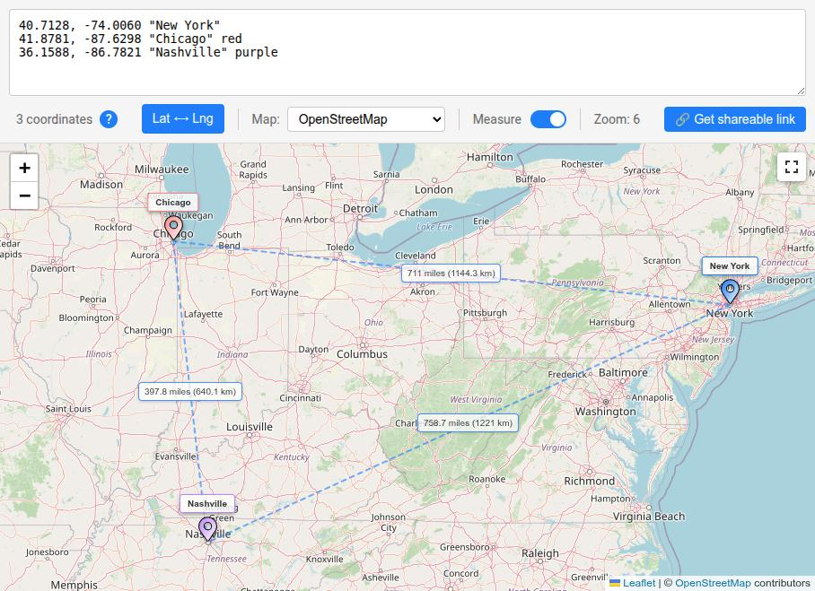

# MapTool



MapTool is a vibe-coded React app for visualizing geographic coordinates on an interactive map. Input latitude and longitude pairs, and see them as markers with optional labels and colors.

- Live parsing and validation
- Multiple map styles
- Shareable URLs

## Quick Start
```bash
cd maptool
npm install
npm start
```

For full usage instructions, features, and deployment guides, see [maptool/README.md](maptool/README.md).

## Demo

Try it out here: [MapTool](https://indek.eu/maptool)
